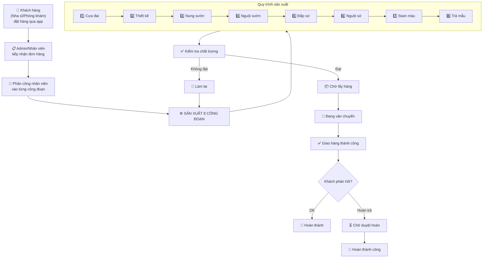
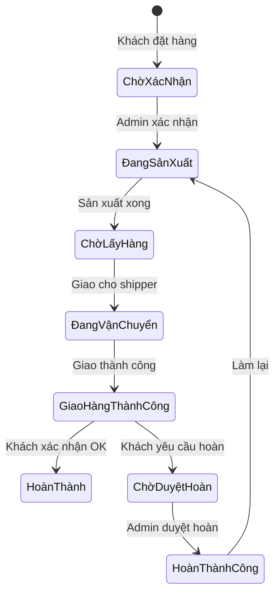
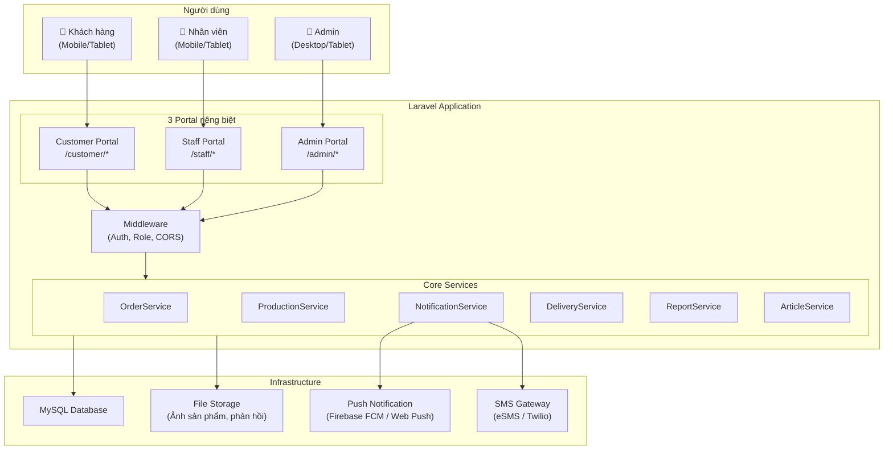
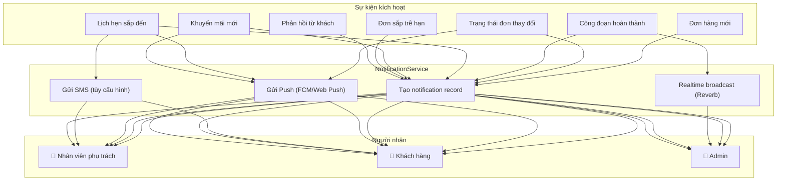

# HoanKiem LAB - Hệ Thống Quản Lý Sản Xuất Răng Giả

> Cập nhật theo mô tả yêu cầu từ Giám đốc — 26/06/2026

---

## 1. Tổng Quan & Ý Tưởng Cốt Lõi

### Bối cảnh
Xây dựng hệ thống **web app quản lý toàn diện** cho công ty sản xuất răng giả, phục vụ **3 nhóm người dùng** rõ ràng:

| Nhóm | Vai trò | Mục đích chính |
|---|---|---|
| 🦷 **Khách hàng** (Nha sĩ / Phòng khám) | Mỗi phòng khám/bác sĩ là 1 user | Đặt hàng, theo dõi đơn, phản hồi, thanh toán |
| 👷 **Nhân viên** | Phân theo công đoạn sản xuất | Cập nhật tiến độ, quản lý lịch hẹn, vật liệu |
| 🔑 **Admin** | Quản trị toàn bộ | Quản lý đơn, doanh thu, phân quyền, nội dung |

### Ý tưởng cốt lõi
- Tập trung vào **quản lý đơn hàng, tiến độ sản xuất, thông báo realtime, chăm sóc khách hàng, và báo cáo doanh thu**
- **Phân quyền rõ ràng**: khách hàng theo dõi đơn hàng → nhân viên cập nhật tiến độ → admin quản lý toàn bộ
- Tích hợp **nút gọi tổng đài** và **push notification** để tăng tương tác
- Giao diện **app-like** (PWA), responsive, hoạt động mượt trên mobile

### Công nghệ

| Thành phần | Công nghệ | Lý do |
|---|---|---|
| Backend | **PHP 8.2+ (Laravel 11)** | Framework mạnh, hệ sinh thái phong phú |
| Frontend | **Blade + Livewire 3 + Alpine.js** | App-like SPA feel mà không cần framework JS riêng |
| Database | **MySQL 8.0** (chạy qua XAMPP) | Ổn định, phù hợp quy mô |
| Realtime | **Laravel Reverb / Pusher** | Push notification, cập nhật trạng thái realtime |
| PWA | **Service Worker + Web Push API** | Cài đặt như app trên điện thoại, nhận thông báo |
| SMS/OTP | **Twilio / eSMS / StringeeX** | Đăng nhập bằng SĐT, gửi thông báo SMS |
| File Storage | **Local / S3** | Lưu ảnh sản phẩm, ảnh phản hồi, avatar |
| PDF | **DomPDF / Snappy** | In phiếu đơn hàng, báo cáo |

> [!NOTE]
> Nếu muốn dùng **PHP thuần** thay vì Laravel, hệ thống vẫn triển khai được nhưng thời gian phát triển sẽ tăng gấp **2-3 lần** và khó bảo trì hơn đáng kể.

---

## 2. Quy Trình Nghiệp Vụ

### 2.1 Quy trình tổng thể



### 2.2 Các công đoạn sản xuất chi tiết

| # | Công đoạn | Mô tả | Vật liệu chính | Thời gian ước tính |
|---|---|---|---|---|
| 1 | **Cưa đai** | Cắt mẫu thạch cao, chuẩn bị die | Đĩa cắt, thạch cao | 30 phút |
| 2 | **Thiết kế** | Thiết kế cấu trúc (CAD/thủ công), tạo mẫu sáp | Sáp, phần mềm CAD | 1-2 giờ |
| 3 | **Nung sườn** | Nung khung sườn kim loại/zirconia | Kim loại, Zirconia blank | 2-4 giờ |
| 4 | **Nguội sườn** | Làm nguội, mài chỉnh khung sườn | Đá mài, cao su | 30-60 phút |
| 5 | **Đắp sứ** | Phủ lớp sứ lên khung sườn | Bột sứ các màu | 1-3 giờ |
| 6 | **Nguội sứ** | Nung và làm nguội sứ | - | 1-2 giờ |
| 7 | **Stain màu** | Tạo hiệu ứng màu tự nhiên, glaze | Stain, Glaze | 30-60 phút |
| 8 | **Trả mẫu** | Kiểm tra cuối, đóng gói, sẵn sàng giao | Hộp đóng gói | 15-30 phút |

### 2.3 Trạng thái đơn hàng (nhìn từ phía khách hàng)



---

## 3. Chi Tiết Chức Năng Theo Nhóm Người Dùng

### 3.1 🦷 Portal Khách Hàng (Nha sĩ / Phòng khám)

#### Đăng nhập & Tài khoản
- Đăng nhập bằng **số điện thoại + mật khẩu** hoặc **mã kích hoạt**
- Đăng nhập **một lần duy nhất** (remember token / persistent session)
- Đăng ký tài khoản mới, quên mật khẩu (qua SMS OTP)
- Quản lý thông tin cá nhân: avatar, tên, ngày sinh, giới tính, địa chỉ
- Đổi mật khẩu, đăng xuất

#### Đơn hàng
- **Xem tình trạng đơn hàng** realtime với 5 trạng thái:
  `Chờ lấy hàng → Đang vận chuyển → Giao hàng thành công → Chờ duyệt hoàn → Hoàn thành`
- Xem **hình ảnh sản phẩm** đã đặt
- **Phản hồi** bằng text hoặc hình ảnh theo từng đơn hàng
- Thống kê **số tiền và số lượng đơn** đã đặt
- Xem lịch sử đơn hàng

#### Thông báo & Tiện ích
- **Push notification** về tiến độ đơn hàng
- Thông báo **khuyến mãi** (có thể bật/tắt)
- **Nút gọi tổng đài** — liên hệ nhanh
- Xem **bài viết / tin tức / khuyến mãi** trong app
- Xem **hệ thống phòng khám / bác sĩ**

#### Thay đổi thời gian trả hàng
- Cho phép **chỉnh sửa thời gian trả hàng mà không cần đăng nhập**
  (qua link riêng hoặc mã đơn hàng)

---

### 3.2 👷 Portal Nhân Viên

#### Đăng nhập & Tài khoản
- Đăng nhập bằng **số điện thoại + mật khẩu** hoặc **mã kích hoạt**
- Quên mật khẩu qua SMS

#### Quản lý công việc
- Xem **danh sách công đoạn** được phân công
- **Cập nhật tiến độ** từng công đoạn sản xuất
- Ghi chú, đính kèm ảnh cho từng bước
- Chuyển trạng thái công đoạn: `Chờ → Đang làm → Hoàn thành`

#### Quản lý khác
- **Quản lý thông tin khách hàng**: xem dữ liệu khách hàng
- **Quản lý lịch hẹn**: chi tiết lịch hẹn theo khách hàng, thời gian
- **Quản lý doanh thu**: xem theo tuần/tháng (tuỳ quyền)
- Xem **bài viết / tin tức / khuyến mãi**
- Xem **danh sách chi nhánh / cửa hàng**

#### Thông báo
- Thông báo khi có **đơn hàng mới** được phân công
- Thông báo **lịch hẹn** sắp tới
- Thông báo **khuyến mãi**

---

### 3.3 🔑 Portal Admin

#### Quản lý đơn hàng
- **Tạo đơn hàng** cho khách hàng theo mẫu form có sẵn
- Quản lý chi tiết từng đơn (xem, sửa, huỷ, phân công)
- Theo dõi tiến độ sản xuất realtime
- Quản lý lịch hẹn

#### Quản lý người dùng
- **Quản lý thông tin khách hàng**: toàn bộ dữ liệu hệ thống
- **Phân quyền nhân viên**: gán nhân viên vào từng khâu sản xuất / dịch vụ
- Tạo / khoá / mở khoá tài khoản

#### Quản lý doanh thu
- Thống kê doanh thu **theo khách hàng**
- Thống kê doanh thu **theo hệ thống** (tuần/tháng/quý/năm)
- Báo cáo công nợ

#### Quản lý nội dung
- Tạo / sửa / xoá **bài viết / tin tức**
- Quản lý **chương trình khuyến mãi**
- Quản lý **thông báo push** gửi cho khách hàng
- Quản lý danh sách **chi nhánh / cửa hàng**

#### Quản lý sản xuất
- Quản lý **danh mục sản phẩm** (loại răng, vật liệu)
- Quản lý **quy trình sản xuất** (8 công đoạn)
- Quản lý **vật liệu & tồn kho**
- Quản lý **nhà cung cấp**

---

## 4. Thiết Kế Database Chi Tiết

### 4.1 Sơ đồ quan hệ (ERD)

```mermaid
erDiagram
    USERS ||--o{ ORDERS : "đặt/tạo đơn"
    USERS ||--o{ PRODUCTION_ASSIGNMENTS : "được phân công"
    USERS ||--o{ APPOINTMENTS : "có lịch hẹn"
    USERS {
        int id PK
        string phone "SĐT đăng nhập"
        string password
        string activation_code "Mã kích hoạt"
        string role "admin|staff|customer"
        string name
        string avatar
        date birthday
        string gender
        string address
        string email
        int branch_id FK "Chi nhánh (nhân viên)"
        string clinic_name "Tên phòng khám (khách hàng)"
        string dentist_name "Tên bác sĩ (khách hàng)"
        string tax_code
        boolean is_active
        boolean notify_promotion "Bật/tắt thông báo KM"
        string remember_token
        datetime last_login_at
    }

    BRANCHES {
        int id PK
        string name "Tên chi nhánh/cửa hàng"
        string address
        string phone
        string hotline
        string working_hours
        float latitude
        float longitude
        boolean is_active
    }

    ORDERS ||--o{ ORDER_ITEMS : "chứa"
    ORDERS ||--o{ ORDER_STATUS_LOGS : "lịch sử"
    ORDERS ||--o{ ORDER_FEEDBACKS : "phản hồi"
    ORDERS ||--o{ DELIVERIES : "giao hàng"
    ORDERS {
        int id PK
        string order_code "DH-YYYYMMDD-XXX"
        int customer_id FK "users.id (role=customer)"
        int created_by FK "users.id (admin/staff tạo)"
        int branch_id FK
        date received_date "Ngày nhận đơn"
        date due_date "Ngày hẹn trả"
        date adjusted_due_date "Ngày trả đã chỉnh (không cần login)"
        string priority "normal|urgent|emergency"
        string production_status "pending|confirmed|in_production|qc_passed|ready"
        string delivery_status "waiting_pickup|shipping|delivered|pending_return|returned"
        string overall_status "new|processing|completed|cancelled"
        text notes "Ghi chú từ bác sĩ"
        decimal total_amount
        decimal discount
        decimal paid_amount
        string payment_status "unpaid|partial|paid"
        json product_images "Ảnh sản phẩm"
    }

    ORDER_ITEMS ||--o{ PRODUCTION_STEPS : "qua các công đoạn"
    ORDER_ITEMS {
        int id PK
        int order_id FK
        int product_type_id FK
        string tooth_numbers "11,12,13..."
        string shade "Màu: A1,A2,B1..."
        string material_type
        text specifications
        int quantity
        decimal unit_price
        decimal amount
    }

    PRODUCT_TYPES {
        int id PK
        string name "Răng sứ kim loại, Toàn sứ..."
        string category
        int estimated_days
        decimal base_price
        boolean is_active
    }

    PRODUCTION_STEPS {
        int id PK
        int order_item_id FK
        int step_number "1-8"
        string step_name "Cưa đai|Thiết kế|Nung sườn|..."
        int assigned_to FK "users.id (nhân viên)"
        string status "waiting|in_progress|completed|rework"
        datetime started_at
        datetime completed_at
        text notes
        json step_images "Ảnh công đoạn"
        text rework_reason
    }

    PRODUCTION_ASSIGNMENTS {
        int id PK
        int user_id FK "Nhân viên"
        string step_name "Công đoạn được phân"
        int branch_id FK
        boolean is_primary "Công đoạn chính"
    }

    ORDER_FEEDBACKS {
        int id PK
        int order_id FK
        int customer_id FK
        text content "Nội dung phản hồi"
        json images "Ảnh phản hồi"
        string status "pending|reviewed|resolved"
        text admin_reply
        datetime created_at
    }

    ORDER_STATUS_LOGS {
        int id PK
        int order_id FK
        string from_status
        string to_status
        int changed_by FK
        text notes
        datetime created_at
    }

    DELIVERIES {
        int id PK
        int order_id FK
        string method "pickup|courier|internal"
        string courier_name
        string tracking_number
        datetime scheduled_at
        datetime shipped_at
        datetime delivered_at
        string status "pending|shipped|delivered|return_pending|returned"
        int delivered_by FK
        string recipient_name
        string recipient_phone
        text notes
        json proof_photos "Ảnh xác nhận giao"
    }

    APPOINTMENTS {
        int id PK
        int customer_id FK
        int staff_id FK
        int branch_id FK
        int order_id FK "Liên kết đơn hàng (nếu có)"
        datetime appointment_date
        string type "consultation|delivery|checkup|other"
        string status "scheduled|confirmed|completed|cancelled"
        text notes
    }

    MATERIALS ||--o{ MATERIAL_TRANSACTIONS : "giao dịch"
    MATERIALS {
        int id PK
        string code
        string name
        string category "metal|ceramic|acrylic|consumable"
        string unit "gram|ml|piece"
        decimal current_stock
        decimal min_stock
        decimal unit_cost
        int supplier_id FK
        date expiry_date
    }

    MATERIAL_TRANSACTIONS {
        int id PK
        int material_id FK
        string type "import|export|adjust"
        decimal quantity
        int reference_id "order_item_id / PO id"
        string reference_type
        int performed_by FK
        datetime created_at
    }

    SUPPLIERS {
        int id PK
        string name
        string contact_person
        string phone
        string email
        string address
    }

    ARTICLES {
        int id PK
        string title
        string slug
        string type "news|promotion|guide"
        text content
        string cover_image
        boolean is_published
        boolean show_hotline_button
        datetime published_at
        int created_by FK
    }

    PROMOTIONS {
        int id PK
        string title
        string code "Mã KM"
        string type "percent|fixed"
        decimal value
        datetime start_date
        datetime end_date
        boolean is_active
        text description
        string cover_image
    }

    NOTIFICATIONS {
        int id PK
        int user_id FK
        string type "order_status|promotion|appointment|system"
        string title
        text content
        json data "Dữ liệu bổ sung"
        boolean is_read
        datetime created_at
    }

    PAYMENTS {
        int id PK
        int order_id FK
        int customer_id FK
        decimal amount
        string method "cash|transfer|card"
        string status "pending|confirmed"
        text notes
        int confirmed_by FK
        datetime paid_at
    }

    SETTINGS {
        int id PK
        string key
        string value
        string group "general|hotline|notification"
    }

    ACTIVITY_LOGS {
        int id PK
        int user_id FK
        string action
        string model_type
        int model_id
        json old_values
        json new_values
        datetime created_at
    }
```



### 4.2 Tổng hợp các bảng

| Nhóm | Bảng | Mục đích |
|---|---|---|
| **Người dùng** | `users`, `branches`, `production_assignments` | Quản lý 3 loại user + chi nhánh + phân công |
| **Đơn hàng** | `orders`, `order_items`, `product_types` | Đơn hàng & sản phẩm |
| **Sản xuất** | `production_steps`, `order_status_logs` | 8 công đoạn + lịch sử trạng thái |
| **Giao hàng** | `deliveries` | 5 trạng thái giao hàng |
| **Phản hồi** | `order_feedbacks` | Phản hồi text + ảnh từ khách |
| **Lịch hẹn** | `appointments` | Lịch hẹn khách hàng |
| **Vật liệu** | `materials`, `material_transactions`, `suppliers` | Kho + nhà cung cấp |
| **Tài chính** | `payments` | Thanh toán & công nợ |
| **Nội dung** | `articles`, `promotions` | Bài viết + khuyến mãi |
| **Thông báo** | `notifications` | Push notification |
| **Hệ thống** | `settings`, `activity_logs` | Cấu hình + audit log |

---

## 5. Kiến Trúc Hệ Thống

### 5.1 Kiến trúc tổng thể



### 5.2 Cấu trúc thư mục

```
HoanKiemLAB/
├── app/
│   ├── Http/
│   │   ├── Controllers/
│   │   │   ├── Auth/
│   │   │   │   ├── LoginController.php        # Đăng nhập SĐT + mật khẩu
│   │   │   │   ├── RegisterController.php     # Đăng ký
│   │   │   │   └── ForgotPasswordController.php
│   │   │   ├── Customer/                      # Portal khách hàng
│   │   │   │   ├── DashboardController.php
│   │   │   │   ├── OrderController.php
│   │   │   │   ├── FeedbackController.php
│   │   │   │   ├── ProfileController.php
│   │   │   │   └── NotificationController.php
│   │   │   ├── Staff/                         # Portal nhân viên
│   │   │   │   ├── DashboardController.php
│   │   │   │   ├── ProductionController.php
│   │   │   │   ├── AppointmentController.php
│   │   │   │   └── CustomerInfoController.php
│   │   │   └── Admin/                         # Portal admin
│   │   │       ├── DashboardController.php
│   │   │       ├── OrderController.php
│   │   │       ├── UserController.php
│   │   │       ├── ProductionController.php
│   │   │       ├── MaterialController.php
│   │   │       ├── DeliveryController.php
│   │   │       ├── RevenueController.php
│   │   │       ├── ArticleController.php
│   │   │       ├── PromotionController.php
│   │   │       ├── BranchController.php
│   │   │       └── SettingController.php
│   │   ├── Middleware/
│   │   │   ├── RoleMiddleware.php             # Kiểm tra role
│   │   │   └── EnsurePhoneVerified.php
│   │   └── Requests/                          # Form validation
│   ├── Models/
│   │   ├── User.php
│   │   ├── Order.php
│   │   ├── OrderItem.php
│   │   ├── ProductionStep.php
│   │   ├── Delivery.php
│   │   ├── Material.php
│   │   ├── Appointment.php
│   │   ├── Article.php
│   │   ├── Promotion.php
│   │   ├── Notification.php
│   │   └── ...
│   ├── Services/
│   │   ├── OrderService.php
│   │   ├── ProductionService.php
│   │   ├── NotificationService.php
│   │   ├── SmsService.php
│   │   ├── DeliveryService.php
│   │   └── ReportService.php
│   ├── Events/
│   │   ├── OrderStatusChanged.php
│   │   ├── ProductionStepCompleted.php
│   │   └── NewOrderCreated.php
│   ├── Listeners/
│   │   ├── SendOrderStatusNotification.php
│   │   ├── UpdateProductionProgress.php
│   │   └── SendPushNotification.php
│   ├── Notifications/
│   │   ├── OrderStatusUpdated.php
│   │   ├── PromotionNotification.php
│   │   └── AppointmentReminder.php
│   └── Policies/
│       ├── OrderPolicy.php
│       └── UserPolicy.php
├── database/
│   ├── migrations/
│   ├── seeders/
│   │   ├── RoleSeeder.php
│   │   ├── StepTemplateSeeder.php
│   │   └── DemoDataSeeder.php
│   └── factories/
├── resources/
│   ├── views/
│   │   ├── layouts/
│   │   │   ├── customer.blade.php             # Layout app khách hàng
│   │   │   ├── staff.blade.php                # Layout app nhân viên
│   │   │   └── admin.blade.php                # Layout admin dashboard
│   │   ├── auth/
│   │   ├── customer/                          # Views khách hàng
│   │   │   ├── dashboard.blade.php
│   │   │   ├── orders/
│   │   │   ├── profile/
│   │   │   └── notifications/
│   │   ├── staff/                             # Views nhân viên
│   │   │   ├── dashboard.blade.php
│   │   │   ├── production/
│   │   │   └── appointments/
│   │   ├── admin/                             # Views admin
│   │   │   ├── dashboard.blade.php
│   │   │   ├── orders/
│   │   │   ├── users/
│   │   │   ├── production/
│   │   │   ├── materials/
│   │   │   ├── revenue/
│   │   │   ├── articles/
│   │   │   └── settings/
│   │   └── public/                            # Trang công khai
│   │       ├── articles/
│   │       ├── promotions/
│   │       └── due-date-change.blade.php      # Chỉnh ngày trả (ko cần login)
│   ├── css/
│   └── js/
├── routes/
│   ├── web.php
│   ├── customer.php                           # Routes khách hàng
│   ├── staff.php                              # Routes nhân viên
│   └── admin.php                              # Routes admin
├── public/
│   ├── uploads/
│   │   ├── products/                          # Ảnh sản phẩm
│   │   ├── feedbacks/                         # Ảnh phản hồi
│   │   ├── avatars/                           # Avatar user
│   │   └── articles/                          # Ảnh bài viết
│   ├── sw.js                                  # Service Worker (PWA)
│   └── manifest.json                          # PWA manifest
└── config/
```

---

## 6. Giao Diện Người Dùng (UI/UX)

### 6.1 Portal Khách Hàng (Mobile-first)

```
┌──────────────────────────┐
│  🦷 HoanKiem LAB         │
│  ┌──────────────────────┐ │
│  │ 📰 Bài viết / KM     │ │  ← Carousel tin tức & khuyến mãi
│  │ [Slide 1] [Slide 2]  │ │
│  └──────────────────────┘ │
│                           │
│  ┌─────┐ ┌─────┐ ┌─────┐ │
│  │ 📋  │ │ 📊  │ │ 🏥  │ │  ← Quick actions
│  │ Đơn │ │Thống│ │ Chi │ │
│  │ hàng│ │ kê  │ │nhánh│ │
│  └─────┘ └─────┘ └─────┘ │
│                           │
│  📦 Đơn hàng gần đây     │
│  ┌──────────────────────┐ │
│  │ DH-20260626-001      │ │
│  │ Răng sứ toàn phần    │ │
│  │ 🟡 Đang vận chuyển   │ │  ← Trạng thái realtime
│  │ [Xem chi tiết]       │ │
│  └──────────────────────┘ │
│  ┌──────────────────────┐ │
│  │ DH-20260625-003      │ │
│  │ 🟢 Giao hàng TC      │ │
│  │ [Phản hồi] [Xem]    │ │
│  └──────────────────────┘ │
│                           │
│  📞 Gọi tổng đài         │  ← Nút gọi nhanh (floating)
│                           │
│  ┌────┬────┬────┬────┐   │
│  │ 🏠 │ 📋 │ 🔔 │ 👤 │   │  ← Bottom navigation
│  │Home│ĐH  │T.B │ Tôi│   │
│  └────┴────┴────┴────┘   │
└──────────────────────────┘
```

### 6.2 Portal Nhân Viên (Mobile-first)

```
┌──────────────────────────┐
│  👷 HoanKiem LAB Staff    │
│                           │
│  Xin chào, Nguyễn Văn A  │
│  Công đoạn: Đắp sứ       │
│                           │
│  📊 Tổng quan hôm nay    │
│  ┌──────┐ ┌──────┐       │
│  │  5   │ │  3   │       │
│  │Chờ SX│ │Đang  │       │
│  └──────┘ └──────┘       │
│                           │
│  📋 Việc cần làm         │
│  ┌──────────────────────┐ │
│  │ 🔴 DH-001 | GẤP      │ │
│  │ Đắp sứ - 4 răng      │ │
│  │ Hạn: 27/06 14:00     │ │
│  │ [Bắt đầu làm]        │ │
│  └──────────────────────┘ │
│  ┌──────────────────────┐ │
│  │ 🟡 DH-005            │ │
│  │ Đắp sứ - 2 răng      │ │
│  │ Đang làm ⏱ 01:25:30  │ │
│  │ [Hoàn thành] [Ghi chú]│ │
│  └──────────────────────┘ │
│                           │
│  ┌────┬────┬────┬────┐   │
│  │ 🏠 │ 📋 │ 📅 │ 👤 │   │
│  │Home│Việc│Hẹn │ Tôi│   │
│  └────┴────┴────┴────┘   │
└──────────────────────────┘
```

### 6.3 Portal Admin (Desktop-first)

```
┌─────────────────────────────────────────────────────────────────┐
│  🔑 HoanKiem LAB Admin                              🔔 5  👤   │
├──────────┬──────────────────────────────────────────────────────┤
│          │                                                      │
│ 📊 Dashboard │  ┌──────┐ ┌──────┐ ┌──────┐ ┌──────┐           │
│ 📋 Đơn hàng  │  │  42  │ │  18  │ │  7   │ │ 156M │           │
│ 👥 Khách hàng│  │Đơn mới│ │Đang SX│ │Chờ giao│ │DT tháng│      │
│ 👷 Nhân viên │  └──────┘ └──────┘ └──────┘ └──────┘           │
│ ⚙️ Sản xuất  │                                                  │
│ 📦 Vật liệu │  📈 Biểu đồ doanh thu                           │
│ 🚚 Giao hàng│  ┌──────────────────────────────────────┐       │
│ 📅 Lịch hẹn │  │ ████                                 │       │
│ 💰 Doanh thu │  │ ██████████                           │       │
│ 📰 Bài viết │  │ ████████                              │       │
│ 🎁 Khuyến mãi│  │ ████████████████                     │       │
│ 🏥 Chi nhánh│  └──────────────────────────────────────┘       │
│ ⚙️ Cài đặt  │                                                  │
│              │  ⚠️ Cảnh báo                                    │
│              │  • 3 đơn sắp trễ hạn                            │
│              │  • 2 vật liệu sắp hết                           │
│              │  • 1 phản hồi chưa xử lý                        │
│              │                                                  │
└──────────┴──────────────────────────────────────────────────────┘
```

### 6.4 Nguyên tắc thiết kế UI

- **Mobile-first** cho portal Khách hàng & Nhân viên (dùng trong phòng khám & xưởng)
- **Desktop-first** cho portal Admin (dùng văn phòng)
- **PWA** — cài đặt như app trên điện thoại, nhận push notification
- **Dark/Light mode** toggle
- **Color coding trạng thái:**
  - 🔵 Chờ xác nhận | 🟡 Đang sản xuất | 🟢 Hoàn thành | 🔴 Trễ hạn/Gấp | 🟣 Hoàn trả
- **Floating hotline button** — luôn hiển thị trên portal khách hàng
- **Pull-to-refresh** & **infinite scroll** cho danh sách
- **Smooth animations** & **skeleton loading**

---

## 7. Luồng Thông Báo (Notification Flow)



---

## 8. Lộ Trình Phát Triển

### Giai đoạn 1: Nền tảng & Auth & Đơn hàng (5-6 tuần)

> [!IMPORTANT]
> Ưu tiên số 1: Xây dựng nền tảng + khả năng tạo & theo dõi đơn hàng

| Tuần | Công việc |
|---|---|
| 1-2 | Khởi tạo Laravel, cấu hình XAMPP, migrations, seeders, hệ thống Auth (SĐT + mật khẩu + mã kích hoạt), 3 layout portal |
| 3-4 | Module đơn hàng: CRUD, form tạo đơn (Admin), xem đơn (Khách hàng), trạng thái đơn, upload ảnh sản phẩm |
| 5-6 | Module khách hàng: quản lý profile, danh sách khách, tìm kiếm. Dashboard cơ bản cho cả 3 portal |

**✅ Deliverable:** Đăng nhập 3 portal, tạo đơn hàng, khách xem đơn, quản lý khách hàng

---

### Giai đoạn 2: Sản xuất & Phân công (4-5 tuần)

| Tuần | Công việc |
|---|---|
| 7-8 | 8 công đoạn sản xuất: tạo tự động khi duyệt đơn, phân công nhân viên, cập nhật tiến độ |
| 9-10 | Phân quyền nhân viên theo công đoạn, board quản lý sản xuất (Admin), danh sách việc (Nhân viên) |
| 11 | Quản lý lịch hẹn, hệ thống chi nhánh/cửa hàng |

**✅ Deliverable:** Flow sản xuất 8 bước hoạt động, nhân viên cập nhật tiến độ, admin theo dõi toàn bộ

---

### Giai đoạn 3: Giao hàng & Phản hồi & Thông báo (4-5 tuần)

| Tuần | Công việc |
|---|---|
| 12-13 | Module giao hàng 5 trạng thái, phản hồi đơn hàng (text + ảnh), xử lý hoàn trả |
| 14-15 | Hệ thống thông báo: in-app notifications, push notification (FCM), SMS gateway |
| 16 | Trang chỉnh ngày trả hàng (không cần login), nút gọi tổng đài |

**✅ Deliverable:** Vòng đời đơn hàng hoàn chỉnh, khách nhận thông báo realtime, phản hồi đơn hàng

---

### Giai đoạn 4: Nội dung & Doanh thu & Vật liệu (4-5 tuần)

| Tuần | Công việc |
|---|---|
| 17-18 | Module bài viết/tin tức, quản lý khuyến mãi, hiển thị trên portal khách hàng |
| 19-20 | Báo cáo doanh thu (theo khách, theo hệ thống, tuần/tháng), thanh toán & công nợ |
| 21 | Module vật liệu & tồn kho, nhà cung cấp (cơ bản) |

**✅ Deliverable:** Hệ thống hoàn chỉnh với đầy đủ tính năng theo yêu cầu giám đốc

---

### Giai đoạn 5: PWA & Tối ưu & Nâng cao (3-4 tuần)

| Tuần | Công việc |
|---|---|
| 22-23 | PWA: Service Worker, manifest, offline support, installable trên mobile |
| 24-25 | Tối ưu UX, performance, security audit, testing toàn diện |

**✅ Deliverable:** App cài được trên điện thoại, hoạt động mượt, sẵn sàng go-live

---

### Giai đoạn mở rộng (sau go-live)
- [ ] Barcode/QR code cho đơn hàng
- [ ] Tích hợp CAD/CAM workflow
- [ ] API cho bên thứ 3
- [ ] Tích hợp Zalo OA
- [ ] AI dự đoán thời gian sản xuất
- [ ] Ứng dụng native (React Native / Flutter)

---

## User Review Required

> [!IMPORTANT]
> ### Các quyết định cần xác nhận:
>
> 1. **Framework PHP**: Dùng **Laravel** (khuyến nghị) hay **PHP thuần**?
>    - Laravel: phát triển nhanh ~20-25 tuần, dễ bảo trì
>    - PHP thuần: chậm hơn ~40-50 tuần, khó scale
>
> 2. **SMS Gateway**: Sử dụng dịch vụ nào cho OTP/thông báo SMS? (eSMS, Twilio, StringeeX, VNPT...)
>
> 3. **Push Notification**: Firebase FCM (miễn phí) hay dịch vụ khác?
>
> 4. **Quy trình sản xuất**: 8 công đoạn (Cưa đai → Thiết kế → Nung sườn → Nguội sườn → Đắp sứ → Nguội sứ → Stain màu → Trả mẫu) đã đủ chưa? Có loại sản phẩm nào cần bỏ bớt hoặc thêm công đoạn không?
>
> 5. **Ngôn ngữ giao diện**: Chỉ tiếng Việt hay cần thêm tiếng Anh?
>
> 6. **Hosting**: Chạy local trên XAMPP hay cần deploy lên server/cloud?

## Open Questions

> [!WARNING]
> ### Cần làm rõ trước khi code:
>
> 1. **Thanh toán**: Chỉ ghi nhận công nợ thủ công hay cần tích hợp cổng thanh toán online (VNPay, Momo...)?
>
> 2. **Nút gọi tổng đài**: Số hotline cố định hay thay đổi theo chi nhánh?
>
> 3. **Trang chỉnh thời gian trả hàng không cần login**: Cơ chế xác thực nào? (Mã đơn hàng + SĐT? Link riêng có token?)
>
> 4. **Phản hồi đơn hàng**: Khách có thể phản hồi nhiều lần hay chỉ 1 lần? Admin cần reply lại phản hồi không?
>
> 5. **Doanh thu**: Tính trên giá bán hay cần tính cả chi phí sản xuất (giá vốn, vật liệu)?
>
> 6. **Khuyến mãi**: Áp dụng tự động khi đặt hàng hay chỉ hiển thị thông tin?

---

## Verification Plan

### Automated Tests
```bash
# Unit tests - Business logic
php artisan test --testsuite=Unit

# Feature tests - API & Routes
php artisan test --testsuite=Feature

# Browser tests - UI workflow
php artisan dusk
```

### Manual Verification
1. **Flow đặt hàng**: Khách đăng nhập → Xem đơn → Phản hồi → Nhận thông báo
2. **Flow sản xuất**: Admin tạo đơn → Phân công → Nhân viên cập nhật 8 công đoạn → QC
3. **Flow giao hàng**: Chờ lấy hàng → Vận chuyển → Giao thành công → Hoàn thành
4. **Phân quyền**: Test 3 role login, kiểm tra quyền truy cập
5. **Push notification**: Test nhận thông báo trên mobile
6. **Responsive**: Test trên iPhone, Android, tablet, desktop
7. **Performance**: Test với 500+ đơn hàng, 50+ user đồng thời
